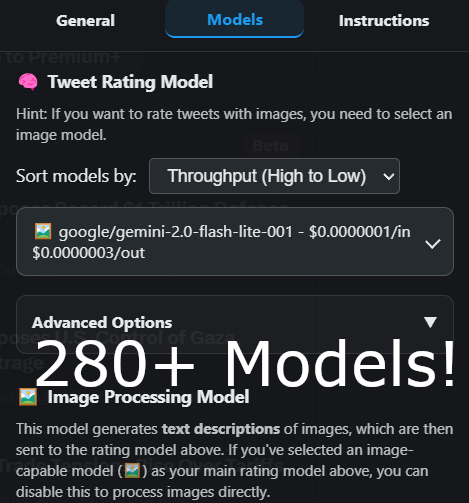
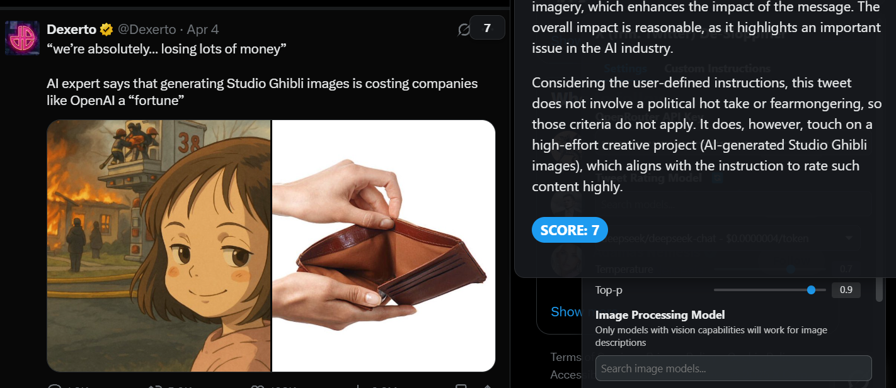

# X/Twitter De-Sloppifier
## Version 1.3.5
Advanced tweet rating and filtering userscript with model selection, enhanced rating indicators, thread hierarchy mapping, and handle management.

## Features

- **Tweet Rating**: Automatically rates tweets on a scale from 1-10 using AI
- **Filtering System**: Hide low-quality tweets based on your chosen threshold
- **Model Selection**: Choose from multiple AI models for tweet rating
- **Image Processing**: Dedicated image model for analyzing tweet images
- **Real-Time Response Streaming (WITH reasoning traces)**: Stream responses from the AI in real time
- **Thread Context**: Improved thread hierarchy detection for better context awareness
- **Media Collection**: Automatically collects all media from threads for comprehensive analysis
- **Handle Management**: Auto-rate specific accounts as 10/10
- **Custom Instructions**: Define your own criteria for how tweets should be rated
- **Dark Theme UI**: Sleek interface matching X's design language
- **Parameter Control**: Adjust temperature and top-p values for both models

  
  

  

## Installation

1. Install a userscript manager like [Tampermonkey](https://www.tampermonkey.net/) or [Violentmonkey](https://violentmonkey.github.io/)
2. Install X/Twitter De-Sloppifier from [GreasyFork](https://greasyfork.org/en/scripts/532459-tweetfilter-ai)
3. Get an API key from [OpenRouter](https://openrouter.ai/)
4. Configure the script with your API key

## Usage

After installation:

1. Navigate to Twitter/X
2. The minimum score filter will appear in the top-right corner
3. Click "Open Menu" to access the full settings
4. Input your OpenRouter API key
5. Choose your preferred models and settings
6. Save settings and enjoy a cleaner Twitter experience

## Configuration

### Rating Model Settings

- Select any OpenRouter-compatible model for tweet rating
- Adjust temperature and top-p parameters to control randomness
- Create custom rating instructions to personalize scoring criteria

### Image Model Settings

- Choose a vision-capable model for image analysis
- Control generation parameters separately from the main model

### Handle Management

- Add Twitter handles to automatically rate as 10/10
- Useful for accounts you always want to see

## How It Works

The userscript analyzes tweets using AI to determine their quality based on:

1. **Text Content**: Evaluates writing quality, information value, and relevance
2. **Media Analysis**: Uses vision-capable models to understand images in tweets
3. **Thread Context**: Maps entire conversation threads to provide full context for replies
4. **Media Collection**: Gathers media from the entire thread for comprehensive analysis
5. **Context Recognition**: Considers conversations and quoted tweets for better rating
6. **Custom Criteria**: Applies your personalized rating instructions

Each tweet receives a score from 1-10, which is displayed in the top-right corner. Low-scoring tweets can be automatically hidden based on your threshold setting.

### Advanced Thread Handling

The latest version includes significant improvements to thread context awareness:
- **Thread Hierarchy Mapping**: Automatically detects parent-child relationships in conversations
- **Complete Media Context**: Collects and analyzes all media from a thread when rating replies
- **Reply Structure Detection**: Uses DOM analysis to determine accurate reply relationships
- **Performance Optimizations**: Thread mapping is throttled and batched to prevent UI freezing

## Prerequisites

- An OpenRouter API key
- A userscript manager extension
- Twitter/X account

## Limitations

- API call limits based on your OpenRouter plan
- Only works on Twitter/X web interface, not the mobile app
- Processing tweets may take a moment depending on the model selected

## Contributing

Contributions are welcome! Feel free to submit issues or pull requests.

## License

This userscript is provided as-is under the MIT License.

## Acknowledgments

- Thanks to OpenRouter for providing model access
- Inspired by the need for a better social media experience
